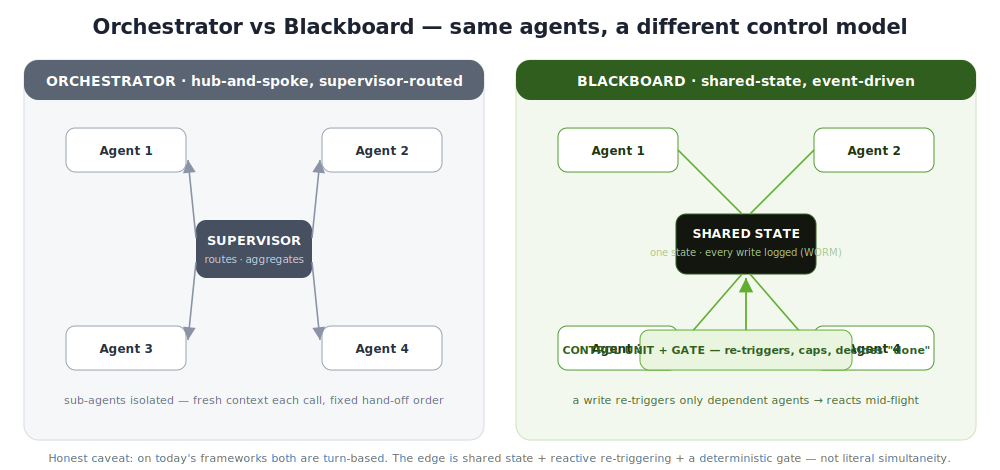

# ovb — Orchestrator vs Blackboard vs Hybrid

**Watch three multi-agent control models solve the *same* task, side by side — and see
which one wastes the fewest agent calls.** A runnable, instrumented lab for anyone
deciding how to coordinate LLM agents.

Same agents, same task, same deterministic done-check. Only the **control loop** differs.
Everything is measured: agent calls, tokens, real $ cost, and a full audit log.



---

## Run it — one click

```bash
git clone <this-repo> && cd ovb
./run.sh                 # opens the live dashboard in your browser
```

- **macOS:** or just **double-click `run.command`** in Finder.
- Also: `make run`, or `uv run ovb serve`, or `pip install -e . && ovb serve`.

**No API key needed.** The dashboard ships with **recorded real Claude calls** you can
replay offline (real tokens & cost, zero spend). `./run.sh` uses [`uv`](https://docs.astral.sh/uv/)
if present, otherwise it creates a local `.venv` on first run.

Share it on your network (no tunnel — works on managed/corporate Macs):

```bash
./run.sh --lan           # prints an http://<your-ip>:8000/ URL for the same Wi-Fi/VPN
```

## The demo: plan a birthday party that fits a budget

Four friends agree on one party plan. Their choices are **interdependent**:

| Agent | Owns | Rule |
|---|---|---|
| **Guests** | the guest list (you'd love 15) | trim the list if the budget won't allow it |
| **Budget** | cost + the affordable headcount | cost = guests × $50; cap $600 ⇒ 12 max |
| **Food** | pizzas | one pizza feeds 3 → 15→5, 12→4 |
| **Chairs** | the chairs | one chair per guest → 15→15, 12→12 |

You want 15 people, but at $50 a head that's $750 — over the $600 budget. Trim to 12,
and the pizza order and the chair count change with it. All three control models reach
the **same** plan (`12 guests · $600 · 4 pizzas · 12 chairs`); they differ only in how
much coordination it takes:

```
              agent calls   wasted (no-op)   tokens (Haiku, real)
orchestrator       12             5                 2,678
blackboard          7             0                 1,494   ← 1.71× fewer calls
hybrid              5             0                   947
```

## The three control models (harnesses)

- **Orchestrator** — a supervisor calls each agent in a fixed order, looping until stable,
  plus a confirming no-op sweep. No shared board, no reactivity. The most turns ("hub tax").
- **Blackboard** — all agents read/write one shared board; a write re-triggers only the
  agents that depend on the changed field. Fewer wasted turns.
- **Hybrid** — a bounded blackboard for the tightly-coupled core (Guests ↔ Budget), then a
  linear supervisor tail (Food, Chairs).

They're the **same agents** behind one **harness** (control loop); only the *scheduling*
differs — see [docs/HARNESS.md](docs/HARNESS.md).

## The story journey (default UI)

`./run.sh` opens a **4-scene, gamified story** written in simple English (A2 level) —
built for people who do not code:

1. **The problem** 🎉 — an animated intro: four friends, $600, a budget bar that overflows.
2. **Three ways** 💬 — "The Boss Way / The Whiteboard Way / The Mix Way" as animated
   cards, plus a **make-your-guess** game (which way needs the least talk?).
3. **The race** 🏁 — three lanes run side by side with **moving dots along the arrows**,
   live boards, turn/wasted/cost counters, and video-style controls
   (pause · one step · slow/normal/fast/max). Watch all three, or **one alone**.
4. **The winner** 🏆 — an animated podium, medals, **confetti**, your-guess payoff, and a
   simple score table. Same party — different amounts of talk.

It replays **recorded real Claude calls** by default (free, offline, no key). A **word
list** explains every term in one line.

## The expert dashboard (`/expert`)

One click from the story (🧠 Expert view): flow diagrams, state boards, agent narration,
play-by-play log, the consolidated comparison table, Glossary, light/dark, and
**modes** — Mock (offline), Cassette (replay real recorded calls), Real API (live
streaming Claude) — plus a **model picker** defaulting to the cheapest (Haiku 4.5).

## Ship it anywhere (`ovb export`)

```bash
ovb export        # → examples/demo.html
```

One **self-contained HTML file** (~74 KB) that replays the recorded real run with **no
server and no install** — open it from a file, email it, or host it on any static page
(GitHub Pages, S3, …).

## CLI

```bash
ovb serve                 # the story journey + /expert  (--lan to share, --ngrok for public)
ovb export                # one-file demo.html — no server, host anywhere
ovb bench                 # all 3 harnesses, mock, + a comparison + output/report.html
ovb models                # compare Haiku/Sonnet/Opus — same result, different cost
ovb run blackboard        # one harness, print its trace
ovb bench --real          # live Claude calls (needs ANTHROPIC_API_KEY in .env, and the
                          #   `real` extra: uv run --extra real ovb …  /  pip install -e '.[real]')
ovb doctor                # what mode am I in?
```

Because decisions are rule-based (the model only *narrates*), the model choice never
changes the plan — only tokens/cost. So use the cheapest that fits. See
[docs/EXAMPLE.md](docs/EXAMPLE.md) for the real 3-model numbers.

## Project structure

```
run.sh · run.command       one-click launchers
pyproject.toml             package + deps (uv/pip); entry point: `ovb`
src/ovb/
  contracts.py             canonical Usage / Event / Engine types
  config.py · pricing.py   run config; dated Claude prices → real $
  core/                    harness.py (the control-loop primitives) · state · registry ·
                           gate · llm (mock/streaming/cassette) · trace (WORM log)
  engines/                 orchestrator · blackboard · hybrid   (scheduling only)
  domain/                  task.py (the party scenario + gate) · agents.py
  eval/                    runner · compare (fairness contract + table)
  viz/                     live.py (server + expert page) · static/ (the story journey:
                           index.html, style.css, app.js) · report.py (static HTML)
  cli.py                   `ovb` command line (serve, export, bench, models, …)
tests/                     deterministic, no network
cassettes/demo.json        recorded real Claude calls (replay offline)
docs/                      HARNESS · WHEN-TO-USE · EXAMPLE · HANDOVER · PLAN · RESEARCH · architecture
```

## Development

```bash
pip install -e ".[dev]"    # or: uv run --extra dev …
make test                  # pytest (deterministic, no network)
make bench                 # regenerate output/report.html
```

New to the code? Start with [docs/HANDOVER.md](docs/HANDOVER.md), then
[docs/HARNESS.md](docs/HARNESS.md).

## Documentation

- **[docs/HARNESS.md](docs/HARNESS.md)** — the harness concept + how the three topologies map to code.
- **[docs/WHEN-TO-USE.md](docs/WHEN-TO-USE.md)** — decision guide: which control model to pick.
- **[docs/EXAMPLE.md](docs/EXAMPLE.md)** — real-Claude worked example (3 models), reproducible offline.
- **[docs/HANDOVER.md](docs/HANDOVER.md)** — cold-start handover & project state.
- **[docs/PLAN.md](docs/PLAN.md)** · **[docs/RESEARCH.md](docs/RESEARCH.md)** · **[docs/architecture.md](docs/architecture.md)**.

## License

MIT — see [LICENSE](LICENSE).
