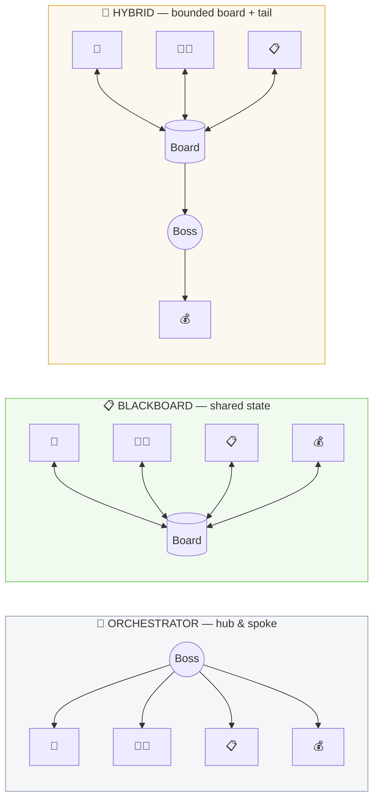

<div align="center">

# 🎭 Orchestrator vs Blackboard

**Four AI agents negotiate one job offer. Three coordination patterns. Same deal — very different bills.**

[](https://github.com/ali-saadat/orchestrator-vs-blackboard/actions/workflows/ci.yml)


[](LICENSE)

*All three reach the identical deal — **$110k + $8k bonus + 4 remote days** — but:*

| | 👔 Orchestrator | 📋 Blackboard | 🤝 Hybrid |
|---|:---:|:---:|:---:|
| **agent turns** | 24 | 14 | **13** |
| **wasted turns** | 🔴 10 | 🟢 0 | 🟢 0 |
| **real cost** (Haiku) | $0.031 | $0.018 | **$0.015** |

</div>

---

## 🚀 Run it — no API key needed

The demo **replays real recorded Claude calls** (real words, tokens, and cost — zero spend, works offline).

| 🍎 macOS / 🐧 Linux | 🪟 Windows |
|---|---|
| `./run.sh` | `run.bat` |
| or double-click `run.command` (Finder) | or double-click `run.bat` (Explorer) |

<sub>Both use [`uv`](https://docs.astral.sh/uv/) if installed, else create a local `.venv` automatically. Manual: `pip install -e . && ovb serve`. Share on your network: `./run.sh --lan`.</sub>

**🔑 Want live AI calls?** Copy `.env.example` → `.env`, add your `ANTHROPIC_API_KEY`, then `ovb bench --real` or pick **Real API** in the dashboard. Never commit `.env`.

## 🎬 What you'll see

A 4-scene, gamified story (simple English, built for non-technical viewers too):
**① the problem** (a $30k salary gap + hidden rules) → **② three ways to talk** + a guess-the-winner game → **③ the race** — three lanes with a from→to message ledger, value pills flying along the arrows, and video-style controls → **④ the winner** — podium, confetti, and the score. Experts: one click to the **`/expert`** dashboard (flow diagrams, WORM log, comparison table, model picker).

## 🧠 The three patterns



- 👔 **Orchestrator** — a supervisor polls every agent in fixed sweeps. No shared state, no reactivity: it re-asks idle agents every round **and** pays a full no-op lap to confirm it is done. That is the 10 wasted turns (the *hub tax*).
- 📋 **Blackboard** — one shared board; **a write wakes only its subscribers**. HR & Finance sleep through the haggle and wake exactly when the deal lands. Work ∝ what changes.
- 🤝 **Hybrid** — the live negotiation shares the board; the sign-off runs once at the end. Wins by encoding structure you already know — and breaks if you get that structure wrong.

**The one-liner:** *the orchestrator pays per agent per round; the blackboard pays per change.*

Same agents, same deterministic done-check, same LLM — only the **control loop** differs, so the gap is attributable to nothing else. Decisions are rule-based (the model narrates), which also means **the model choice never changes the outcome, only the cost** — compare with `ovb models`.

## 🛠 CLI & structure

```bash
ovb serve      # the story + /expert   (--lan to share · --ngrok for a public URL)
ovb export     # ONE self-contained demo.html — replays with no server, host anywhere
ovb bench      # CLI comparison        ovb models   # Haiku vs Sonnet vs Opus, same result
ovb run blackboard --ask 140 --band 115             # one engine, your numbers
```

```
src/ovb/  core/ (harness · state · gate · llm · trace)   ← shared kernel, fairness in code
          engines/ (orchestrator · blackboard · hybrid)  ← ONLY the scheduling differs
          domain/ (the negotiation)  viz/ (story UI + expert)  eval/ (fairness contract)
cassettes/demo.json   recorded real Claude runs (the no-key replay)
docs/     TEACHING · WHEN-TO-USE · HARNESS · EXAMPLE · HANDOVER · RESEARCH
```

## 📚 Learn & teach

| | |
|---|---|
| 🎓 [TEACHING.md](docs/TEACHING.md) | classroom lesson plan — the three journeys narrated from real traces |
| 🧭 [WHEN-TO-USE.md](docs/WHEN-TO-USE.md) | task shape → pattern: tree ⇒ orchestrator · graph ⇒ blackboard · visible split ⇒ hybrid |
| ⚙️ [HARNESS.md](docs/HARNESS.md) | the organizing idea: *agent = model + harness*; these are three harnesses |
| 🔬 [EXAMPLE.md](docs/EXAMPLE.md) | the real recorded numbers, reproducible offline |
| 📖 [RESEARCH.md](docs/RESEARCH.md) | cited state-of-the-art survey (169 sources) |

## 🔗 References

**Blackboard architecture** · [Blackboard system — Wikipedia](https://en.wikipedia.org/wiki/Blackboard_system) · [Nii, *Blackboard Systems* (1986)](https://ojs.aaai.org/aimagazine/index.php/aimagazine/article/view/537) — the classic: knowledge sources + shared board + control shell (Hearsay-II lineage).

**Multi-agent orchestration** · [Anthropic — Building effective agents](https://www.anthropic.com/engineering/building-effective-agents) (the orchestrator-workers pattern) · [Anthropic — How we built our multi-agent research system](https://www.anthropic.com/engineering/built-multi-agent-research-system) (real production numbers) · [LangGraph — multi-agent concepts](https://langchain-ai.github.io/langgraph/concepts/multi_agent/) · [Microsoft — Magentic-One](https://www.microsoft.com/en-us/research/articles/magentic-one-a-generalist-multi-agent-system-for-solving-complex-tasks/).

**The counterpoint (read it!)** · [Cognition — Don't build multi-agents](https://cognition.ai/blog/dont-build-multi-agents) — start with one agent; escalate to a topology only when interdependence or parallelism demands it.

## 📄 License

MIT © [Ali Saadat](https://github.com/ali-saadat)
