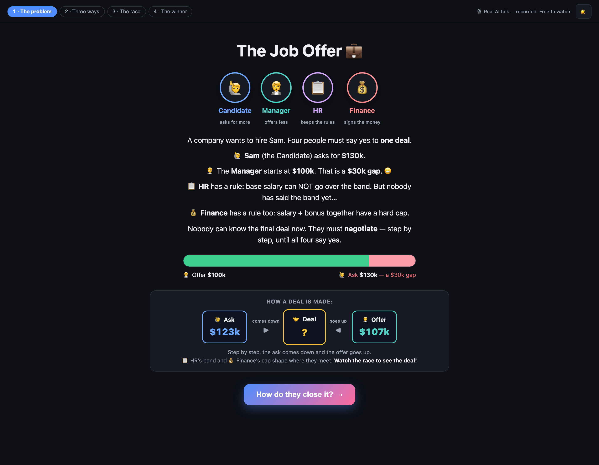
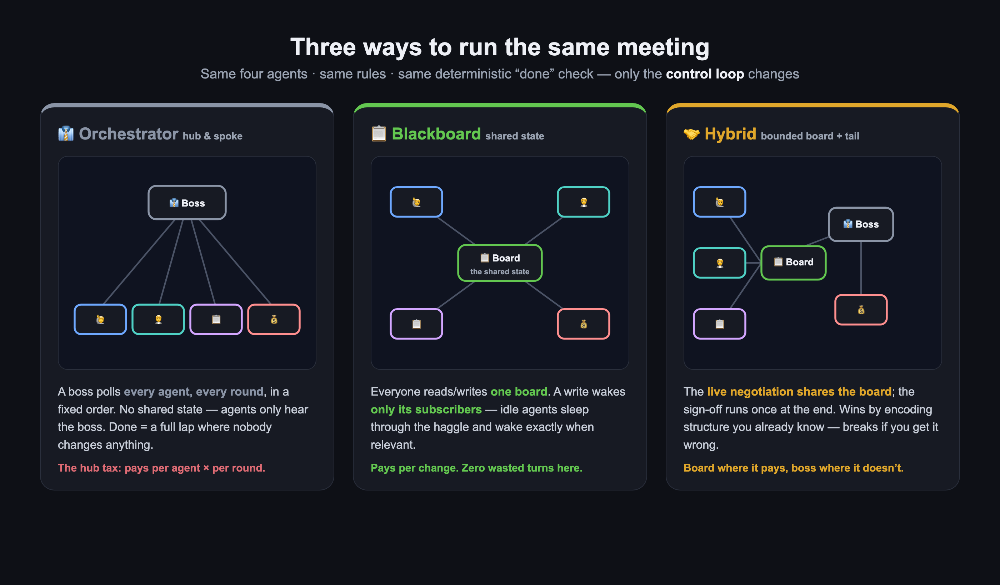
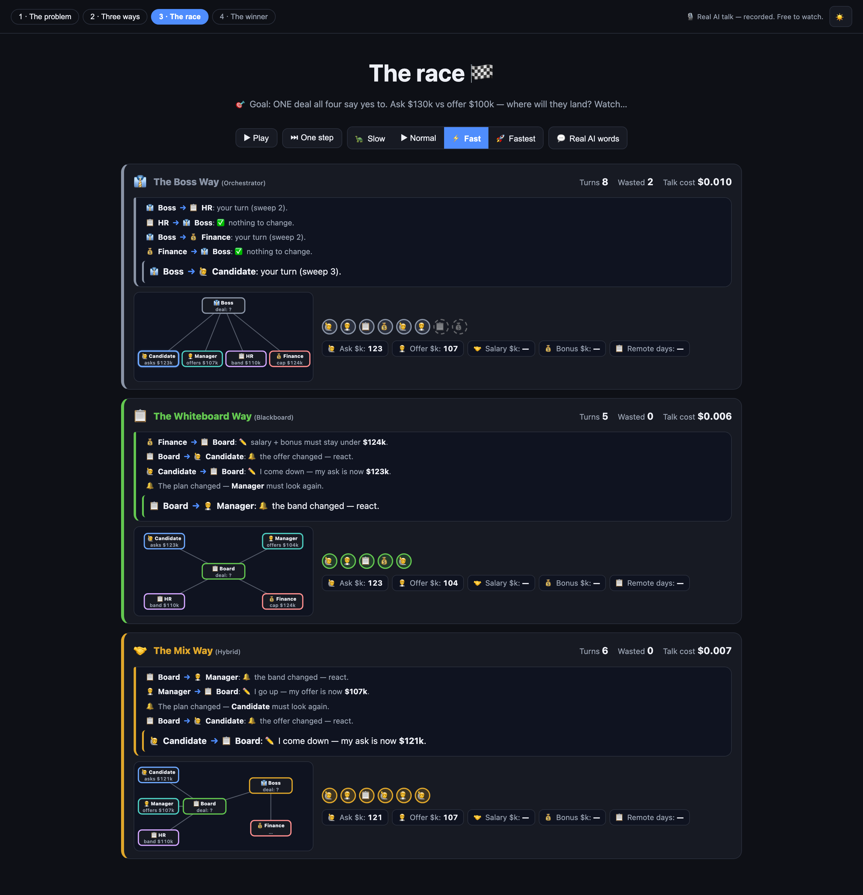
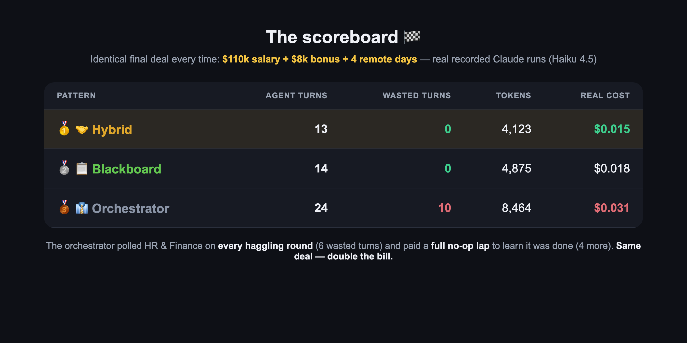
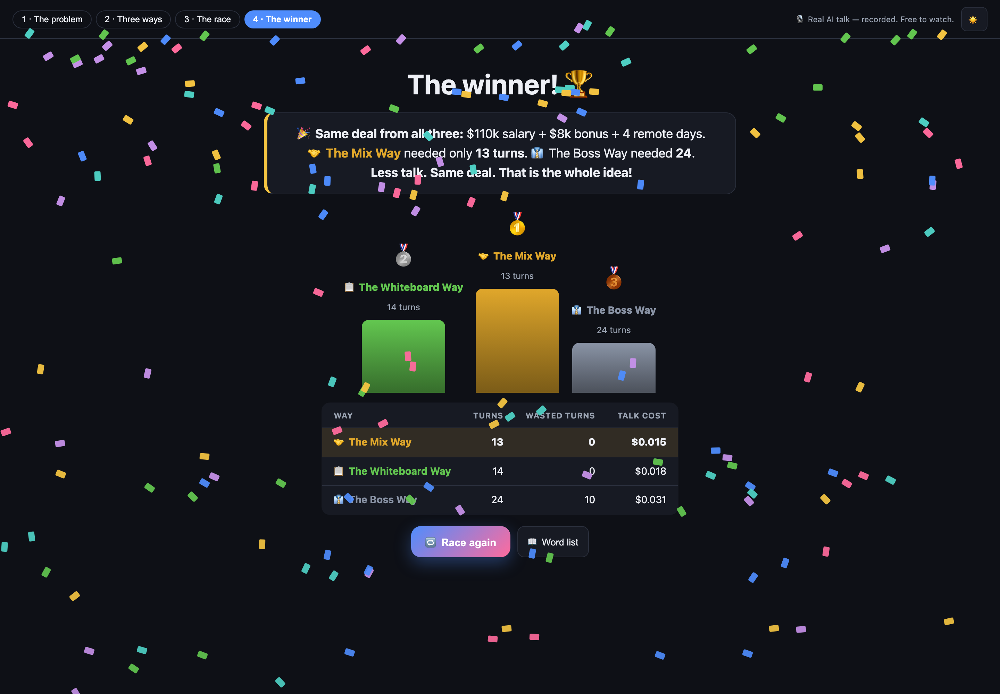

<!--
  MEDIUM POST — ready to paste into the Medium editor.
  Images live in docs/images/post/ — upload them at the marked spots.
  Cover image: 01-hero.png
  Suggested tags: AI Agents, Multi-Agent Systems, Software Architecture, LLM, Anthropic
-->

# Same Agents. Same Deal. One Pattern Paid Double.

### I raced three multi-agent architectures on the exact same job-offer negotiation — with real Claude calls, a live scoreboard, and one uncomfortable bill.


*Four AI agents, one job offer, three coordination patterns. The deal is identical every time. The bill is not.*

Everyone is arguing about **which model** to use.

Almost nobody is measuring **how their agents take turns**.

So I built an experiment that removes every variable except one. Four AI agents negotiate one job offer. Same agents. Same rules. Same finish line. The only thing that changes is the *control loop* — the piece of code that decides **who speaks next**.

The result: one pattern closed the deal in **13 turns**. Another needed **24 turns** — and 10 of them were pure waste. Same deal, same $110k salary, same $8k bonus, same 4 remote days.

**Double the cost, for the privilege of a worse architecture.**

Here's the whole experiment — and a simple rule for when to use each pattern. Everything is open source, and you can replay the real recorded AI runs on your laptop **without an API key**: 👉 [**github.com/ali-saadat/orchestrator-vs-blackboard**](https://github.com/ali-saadat/orchestrator-vs-blackboard)

---

## The setup: a negotiation nobody can shortcut

Meet the cast:

- 🙋 **Candidate** — Sam asks for **$130k**.
- 🧑‍💼 **Manager** — starts at **$100k**. That's a $30k gap. 😬
- 📋 **HR** — has a rule: base salary can't go over the salary band. But nobody has announced the band yet…
- 💰 **Finance** — has a rule too: salary + bonus together have a hard cap.


*The problem, as the interactive demo tells it: a $30k gap, two hidden constraints, and four people who all must say yes.*

Nobody can compute the final deal alone. The ask has to come down step by step, the offer has to come up, HR drops the band bombshell *mid-negotiation*, and Finance signs off at the end. It's a genuinely interdependent problem — the kind multi-agent systems exist for.

One more thing that makes this a fair experiment: the agents' *decisions* are deterministic rules, and a deterministic gate decides when the deal is done. The LLM narrates each move (real Claude calls, recorded and replayable), but it never gets to change the math. That means **every difference you see below comes from the coordination pattern — nothing else.**

## The three ways to run the same meeting

An agent isn't just a model. It's a **model plus a harness** — the loop around it that decides who runs, when, and what they see. These are the three classic harnesses:


*Same four agents, same rules, same "done" check — only the control loop changes.*

**👔 The Orchestrator (hub & spoke).** A boss polls every agent, every round, in a fixed order. There is no shared board — agents only hear the boss. The run ends after a full lap where nobody changes anything. Predictable, auditable, easy to debug. But it pays *per agent × per round*, whether that agent had anything to say or not. I call this **the hub tax**.

**📋 The Blackboard (shared state).** Everyone reads and writes one shared board. A write wakes *only the agents subscribed to that field*. HR and Finance literally sleep through the salary haggling and wake up the moment a salary number lands. Nobody polls anybody. It pays *per change*.

**🤝 The Hybrid (bounded board + tail).** The hot loop — Candidate, Manager, HR — shares the board. Finance runs once, at the end, as a deterministic sign-off step. This wins by encoding structure you already know… and breaks if you encode it wrong.

## The race 🏁

The demo runs all three engines **concurrently on the same problem** and streams every message, every write, every wake-up, side by side. This is mid-race:


*Mid-race. Look at the Boss Way's ledger: "HR → Boss: ✅ nothing to change." "Finance → Boss: ✅ nothing to change." That's the hub tax, live on screen — 2 turns wasted already, while the other two lanes have zero.*

Watch what each pattern *does* with its turns:

- The **orchestrator** asks HR and Finance for input on **every single haggling round** — while the only thing happening is Candidate and Manager trading numbers. Six wasted turns. Then, when the deal is done, it pays for **one more full lap** of "nothing to change" just to learn it's finished. Four more.
- The **blackboard** wakes HR exactly once — when the first salary number hits the board — and Finance exactly once, at the end. Zero waste.
- The **hybrid** does the same, minus even the kickoff call for Finance. It already *knows* Finance is a tail step.

## The scoreboard

All three land on the **identical deal**: $110k salary + $8k bonus + 4 remote days. Real recorded runs on Claude Haiku 4.5:


*Identical outcome. 2× the turns, 2× the tokens, 2× the bill.*

| Pattern | Turns | Wasted | Tokens | Real cost |
|---|---|---|---|---|
| 🥇 Hybrid | **13** | 0 | 4,123 | **$0.015** |
| 🥈 Blackboard | **14** | 0 | 4,875 | $0.018 |
| 🥉 Orchestrator | **24** | **10** | 8,464 | $0.031 |


*Less talk. Same deal. That's the whole idea.*

Three cents doesn't sound scary. But this is four agents and one tiny negotiation on the cheapest model. The hub tax scales with **agents × rounds** — it's the *shape* of the curve that should worry you, not the absolute number. At production scale (more agents, longer runs, bigger models), that 2× gap is real money and real latency.

## So orchestrators are bad? No — and this is the important part.

If I had raced a *different* task, the podium would flip. The orchestrator's "waste" is the price of three things that are sometimes worth everything:

**Use an 👔 orchestrator when the path is known and accountability matters.** Pipelines with a fixed order (research → draft → review → publish), compliance flows where you must show *who was asked, when, in what order*, anything where a wrong step is expensive and you want one throat to choke. The wasted polls are an insurance premium. This is also why Anthropic's own [multi-agent research system](https://www.anthropic.com/engineering/built-multi-agent-research-system) uses an orchestrator at the top: the *task decomposition* is the known structure.

**Use a 📋 blackboard when you don't know who needs to act, or when.** Reactive, event-driven problems: incident response, monitoring, sensor fusion, anything where specialists should stay quiet until their trigger fires. This is the original 1980s [blackboard architecture](https://en.wikipedia.org/wiki/Blackboard_(design_pattern)) insight — opportunistic problem-solving when no fixed schedule fits. The trade: harder to audit, and you must design subscriptions carefully or you get churn instead of silence.

**Use a 🤝 hybrid when part of the structure is known and part isn't.** Bound the reactive board to the genuinely unpredictable hot loop, and run the predictable parts as deterministic steps. Cheapest and fastest here — *because* I knew Finance was a tail step. Encode the wrong structure and it breaks. Knowledge is leverage; wrong knowledge is debt.

And a counterpoint worth reading before you build any of this: Cognition argues you often [shouldn't build multi-agents at all](https://cognition.ai/blog/dont-build-multi-agents) — a single agent with good context beats a committee more often than you'd think. The honest first question isn't "which pattern?" It's "do I need more than one agent?"

## The one-sentence takeaway

> **Your coordination pattern is a pricing model.** The orchestrator pays per agent per round. The blackboard pays per change. The hybrid pays per change where it can't predict, and ~zero where it can.

Pick the pricing model that matches your problem's shape — *before* you pick your model.

## Try it yourself (no API key needed)

Everything above is reproducible in two commands:

```
git clone https://github.com/ali-saadat/orchestrator-vs-blackboard
cd orchestrator-vs-blackboard && ./run.sh     # Windows: run.bat
```

That's it — your browser opens the story-driven demo and replays the **real recorded Claude runs** from a cassette file, offline, free. Add your own Anthropic API key later if you want to run it live, swap models (Haiku/Sonnet/Opus), or change the negotiation numbers and watch the three engines diverge.

The repo is built for teaching: an A2-simple guided story for newcomers, an expert dashboard with full event streams, a [classroom guide](https://github.com/ali-saadat/orchestrator-vs-blackboard/blob/main/docs/TEACHING.md), and a [when-to-use decision guide](https://github.com/ali-saadat/orchestrator-vs-blackboard/blob/main/docs/WHEN-TO-USE.md).

⭐ If this saved you a wasted sprint (or a wasted 10 turns), star the repo: [**github.com/ali-saadat/orchestrator-vs-blackboard**](https://github.com/ali-saadat/orchestrator-vs-blackboard)

---

### References & further reading

- Nii, H.P. (1986) — [*Blackboard Systems*](https://ojs.aaai.org/aimagazine/index.php/aimagazine/article/view/537), AI Magazine — the original architecture.
- [Blackboard design pattern](https://en.wikipedia.org/wiki/Blackboard_(design_pattern)) — Wikipedia.
- Anthropic — [*Building Effective Agents*](https://www.anthropic.com/engineering/building-effective-agents) — workflows vs agents, orchestrator-workers.
- Anthropic — [*How we built our multi-agent research system*](https://www.anthropic.com/engineering/built-multi-agent-research-system).
- LangGraph — [multi-agent architectures](https://langchain-ai.github.io/langgraph/concepts/multi_agent/) — supervisor & network patterns in practice.
- Microsoft — [Magentic-One](https://www.microsoft.com/en-us/research/articles/magentic-one-a-generalist-multi-agent-system-for-solving-complex-tasks/) — a production orchestrator design.
- Cognition — [*Don't Build Multi-Agents*](https://cognition.ai/blog/dont-build-multi-agents) — the case for one good agent.
