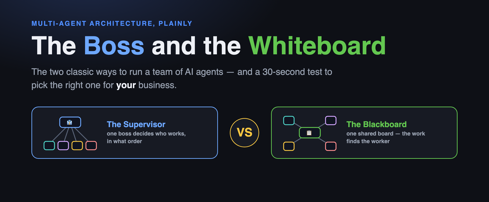
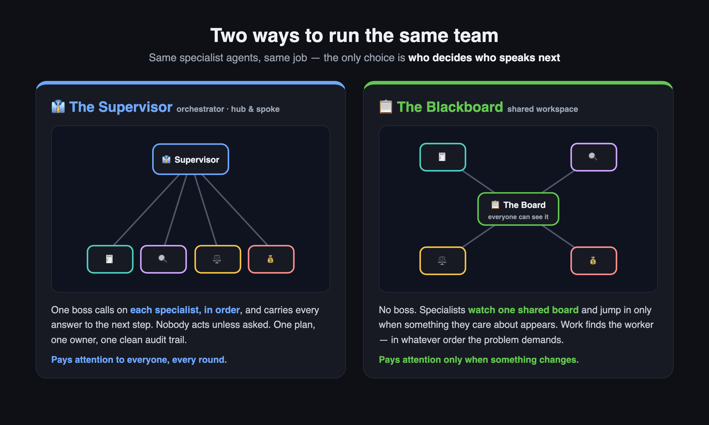
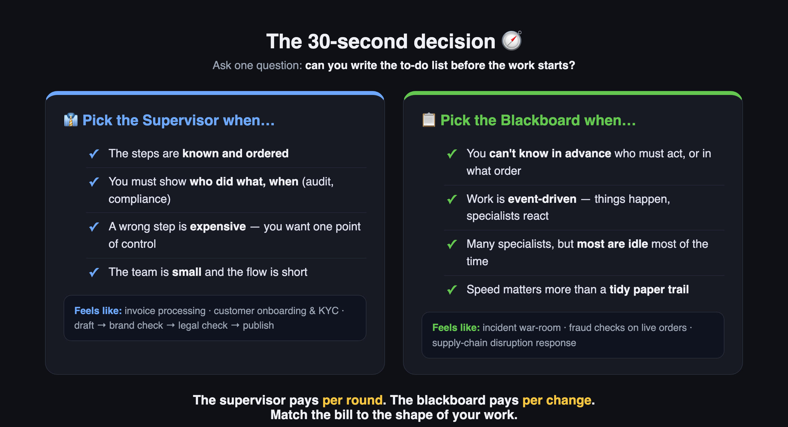

<!--
  MEDIUM POST — ready to paste into the Medium editor (~750 words, ~4 min read).
  Images live in docs/images/post/ — upload them at the marked spots.
  Cover image: 01-hero.png
  Suggested tags: AI Agents, Multi-Agent Systems, Artificial Intelligence, Software Architecture, Small Business
-->

# The Boss and the Whiteboard: The Two Classic Ways to Run a Team of AI Agents

### Supervisor or blackboard? A four-minute guide to the most important multi-agent decision — with examples from businesses like yours.

Every multi-agent AI system ever built is secretly one of two offices. And you've worked in both.

Here's the first one. Rana runs a fourteen-person online furniture shop. Monday, 9 a.m., status meeting. She goes around the table: marketing reports, she decides; ops reports, she decides; finance reports, she decides. Nobody speaks unless spoken to. It takes ninety minutes and half the room spends it waiting — yet nothing slips, and if a decision goes sideways, everyone knows exactly where it was made.

Now the second. Thursday, 2 a.m., the payment provider dies mid-checkout. Nobody calls a meeting. Someone posts on the team board. The developer sees it and switches to the backup provider. Support sees the developer's note and updates the status page. Finance sees support's note and pauses automatic refunds. Nobody assigned anything to anyone. **The problem itself did the assigning.**

Those two mornings have names in AI architecture — and picking the wrong one is the most common way multi-agent projects quietly fail.

## The supervisor: one boss, many hands

The [supervisor (or orchestrator) pattern](https://www.anthropic.com/engineering/building-effective-agents) is Rana's meeting. One coordinator agent decides which specialist works, in what order, and reads every result before choosing the next move. Hub-and-spoke: the agents never talk to each other; everything flows through the boss.

That buys you three precious things: predictability, auditability, debuggability. When something breaks, you replay the boss's decisions like meeting minutes.

The bill: in the classic loop, the boss checks on every agent, every round — turns, tokens and latency in AI terms; time and money in yours. Most check-ins come back "no update, boss." You're billed anyway. And the boss is a bottleneck: nothing moves faster than the chair.

## The blackboard: no boss, one board

The [blackboard pattern](https://en.wikipedia.org/wiki/Blackboard_(design_pattern)) — the AI world's name for the shared team whiteboard — is the 2 a.m. rescue. No coordinator. One board everyone can see. Specialist agents watch it and wake only when something relevant to them appears. Their output lands back on the board, which may wake someone else. Nobody knows the sequence in advance; **the board discovers the sequence.**

The bill is different here. "Who decided that?" has no clean answer. There's no single point of control. And the wake-up triggers need real design work — a blackboard without well-designed triggers is just an expensive argument.

## Match the pattern to the shape of the work

**Supervisor-shaped work** is any process you could draw as a flowchart before it starts.

- **Invoice processing:** intake → extract → validate → approve → pay. Same steps every time — and when the accountant asks why invoice #4127 was paid, the supervisor's log is the answer.
- **Customer onboarding at a lender:** identity check, sanctions screen, credit pull, decision — in that order, with a paper trail a regulator can actually read.
- **Content production:** draft → brand check → legal check → publish. Nothing ships without every gate passing, provably.

**Blackboard-shaped work** is a situation, not a sequence — you can't know in advance who must act, or in what order.

- **Fraud watching at an e-commerce shop:** an odd order lands on the board; the address checker, the velocity checker and the device-fingerprint agent each wake only if the case smells like their specialty.
- **IT incident response:** is it the network, the database, or the update from an hour ago? The evidence decides who works.
- **Supply-chain disruption:** a port closes. Logistics reroutes, procurement hunts for alternates, sales warns the big accounts — and who moves first depends entirely on what broke.

## The pocket checklist

**Pick the supervisor if:** the steps are known before you start; someone — a regulator, an auditor, your accountant — will ask "why?"; a wrong step costs more than a slow one.

**Pick the blackboard if:** you can't script who acts or when; events arrive on their own schedule; reaction speed beats tidy minutes; your specialists are mostly idle until *their* moment comes.

Still torn? Default to the supervisor. Boring and auditable beats clever and unexplainable — right up until your problem stops being a sequence.

Most real systems end up a mix: a supervisor running the regulated core, a blackboard wrapped around it watching for surprises. That's not indecision — it's the same reason your company has both standing meetings and a group chat.

If you keep one line, keep this: **the supervisor bills you per meeting; the blackboard bills you per event. Processes have meetings. Emergencies don't.**

---

*Want to see the difference instead of imagining it? I built an open-source playground where these two patterns (plus a hybrid) race on the same problem, turn by turn, with real measured costs: [github.com/ali-saadat/orchestrator-vs-blackboard](https://github.com/ali-saadat/orchestrator-vs-blackboard).*
